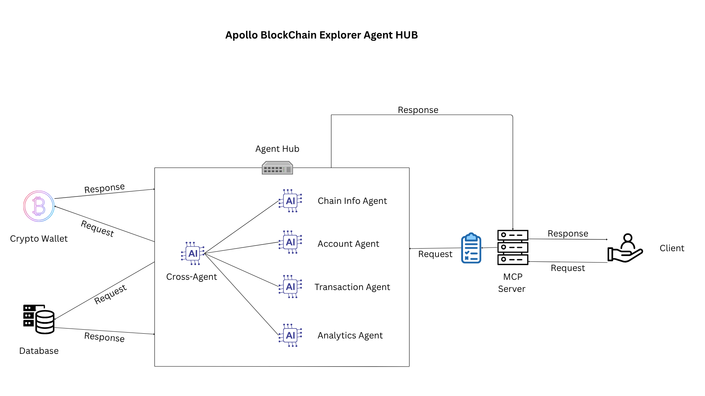

# Apollo Blockchain Explorer Hub
    
    A comprehensive blockchain analytics platform built with FastMCP (Model Context Protocol) server that provides four specialized AI agents, created using Pydantic AI for blockchain data analysis. The system integrates seamlessly with Claude Desktop to enable natural language interactions with blockchain data through cross-agent workflows.

Our HUB features **real-time blockchain queries, account analysis, transaction monitoring, and advanced analytics**, all through **natural language interaction**. 
## 🏗️ Architecture Overview



Apollo consists of four specialized Pydantic AI agents that work together through an MCP server:

- **Chain Agent** - Real-time blockchain information (latest blocks, network status)
- **Account Agent** - Address analysis (native & ERC-20 token balances)  
- **Transaction Agent** - Transaction monitoring and fee estimation
- **Analytics Agent** - Advanced analytics and holder analysis

All agents are connected through cross-agent workflows, allowing complex blockchain analysis through simple natural language queries in Claude Desktop.

## 📁 Project Structure

```
blockchain-explorer-hub/
├─ src/
│  ├─ server.py           # FastMCP server (registers tools/agents)
│  ├─ web3_client.py      # Web3 helper functions (web3.py + Alchemy)
│  ├─ models.py           # Pydantic models for inputs/outputs
│  ├─ agents/
│  │   ├─ chain_agent.py     # Chain information agent
│  │   ├─ account_agent.py   # Account balance agent
│  │   ├─ tx_agent.py        # Transaction status agent
│  │   └─ analytics_agent.py # Analytics & holder analysis
│  └─ db.py               # Supabase client helpers
├─ requirements.txt
├─ .env
└─ README.md
```

## 🚀 Features

- **Real-time Blockchain Data**: Latest block information, gas prices, network status
- **Multi-Token Balance Tracking**: Native ETH and ERC-20 token balances for any address
- **Transaction Monitoring**: Real-time transaction status (pending/confirmed/failed)
- **Advanced Analytics**: Token holder analysis with rankings and insights
- **Cross-Agent Workflows**: Agents work together for complex analysis tasks
- **Natural Language Interface**: Interact with all features through Claude Desktop
- **Persistent Storage**: Analytics results stored in Supabase database

## 🛠️ Prerequisites

- Python 3.8+
- Node.js (for Claude Desktop)
- Alchemy API key (or other Web3 provider)
- Supabase account and project
- Claude Desktop application

## 📋 Installation Guide

### Step 1: Create Python Environment

#### For Windows:
```bash
# Create virtual environment
python -m venv venv

# Activate virtual environment
venv\Scripts\activate
```

#### For macOS/Linux:
```bash
# Create virtual environment
python3 -m venv venv

# Activate virtual environment
source venv/bin/activate
```

### Step 2: Install Dependencies

```bash
# Install all required packages
pip install -r requirements.txt
```

### Step 3: Environment Configuration

Create a `.env` file in the root directory:

```env
# Web3 Provider (Alchemy recommended)
WEB3_PROVIDER_URL=https://eth-mainnet.g.alchemy.com/v2/YOUR_API_KEY

# Supabase Configuration
SUPABASE_URL=https://your-project.supabase.co
SUPABASE_KEY=your-anon-key

# MCP Server Configuration (optional)
MCP_HOST=127.0.0.1
MCP_PORT=4000
```

### Step 4: Database Setup

Create the following tables in your Supabase project:

```sql
-- Analytics results table
CREATE TABLE analytics (
    id SERIAL PRIMARY KEY,
    result JSONB NOT NULL,
    created_at TIMESTAMP DEFAULT CURRENT_TIMESTAMP
);

-- Transfer tracking table  
CREATE TABLE transfers (
    id SERIAL PRIMARY KEY,
    from_address TEXT,
    to_address TEXT,
    amount DECIMAL,
    token_address TEXT,
    tx_hash TEXT,
    created_at TIMESTAMP DEFAULT CURRENT_TIMESTAMP
);
```

## 🖥️ Claude Desktop Integration

### Step 1: Install Claude Desktop

1. Download Claude Desktop from [Claude's official website](https://claude.ai/download)
2. Install the application following the platform-specific instructions
3. Create an account and sign in

### Step 2: Enable Developer Mode

1. Open Claude Desktop
2. Go to Settings (gear icon)
3. Navigate to the "Developer" section
4. Enable "Developer Mode"
5. This allows MCP server connections

### Step 3: Install MCP Server Integration

Navigate to your Apollo project directory and run:

```bash
# Install FastMCP integration with Claude Desktop
fastmcp install claude-desktop src/server.py
```

### Step 4: Manual Configuration (If Needed)

If the automatic installation doesn't work, manually edit Claude Desktop's configuration:

#### For macOS:
Edit `~/Library/Application Support/Claude/claude_desktop_config.json`

#### For Windows:
Edit `%APPDATA%\Claude\claude_desktop_config.json`

#### For Linux:
Edit `~/.config/claude/claude_desktop_config.json`

Add this configuration (replace paths with your actual project location):

```json
{
  "mcpServers": {
    "Apollo Blockchain Explorer": {
      "command": "/Users/username/Desktop/Apollo/venv/bin/python",
      "args": [
        "-m",
        "src.server"
      ],
      "cwd": "/Users/username/Desktop/Apollo",
      "env": {
        "PYTHONPATH": "/Users/username/Desktop/Apollo"
      },
      "transport": "stdio"
    }
  }
}
```

**Important**: Replace `/Users/username/Desktop/Apollo` with your actual project path.

## ▶️ Running the System

### Step 1: Start the MCP Server

```bash
# Ensure virtual environment is activated
source venv/bin/activate  # macOS/Linux
# or
venv\Scripts\activate     # Windows

# Start the Apollo MCP server
python -m src.server
```

You should see output confirming the server is running:
```
FastMCP server "Blockchain Explorer Hub" running on 127.0.0.1:4000
```

### Step 2: Launch Claude Desktop

1. **Exit Claude Desktop completely** if it's already running
2. **Restart Claude Desktop** fresh
3. Wait for the MCP connection to establish (check for Apollo tools in the interface)

### Step 3: Verify Connection

In Claude Desktop, you should see the Apollo Blockchain Explorer tools available. You can test with queries like:

- "What's the latest block number?"
- "Check the ETH balance for address 0x..."
- "Get the top 10 holders of USDC token"

## 🔧 Usage Examples

### Basic Blockchain Queries
```
"What's the current block number and gas usage?"
"Show me the latest block information"
```

### Account Analysis  
```
"Check the ETH balance for 0xd8dA6BF26964aF9D7eEd9e03E53415D37aA96045"
"Get USDC and USDT balances for vitalik.eth"
```

### Transaction Monitoring
```
"Check the status of transaction 0x..."
"What are the current network fees?"
```

### Advanced Analytics
```
"Find the top 10 USDC holders from these addresses: [list]"
"Analyze token distribution for contract 0x..."
```

### Cross-Agent Workflows
```
"Get the latest block, check if address 0x... has any recent transactions, and analyze their token holdings"
```

## 🔍 Troubleshooting

### Connection Issues

1. **MCP Server Not Connecting**:
   - Ensure virtual environment is activated
   - Check that all dependencies are installed
   - Verify `.env` file configuration
   - Restart both the server and Claude Desktop

2. **Web3 Provider Errors**:
   - Verify your Alchemy API key is valid
   - Check network connectivity
   - Ensure the Web3 provider URL is correct

3. **Database Connection Issues**:
   - Verify Supabase URL and API key
   - Check that required tables exist
   - Test Supabase connection independently

### Configuration Issues

1. **Claude Desktop Config**:
   - Ensure JSON syntax is valid
   - Verify all file paths are absolute and correct
   - Check that Python virtual environment path is accurate

2. **Path Issues**:
   - Use absolute paths in configuration
   - Ensure `PYTHONPATH` includes your project directory
   - Verify the virtual environment Python executable path

### Performance Issues

1. **Slow Responses**:
   - Check your Web3 provider rate limits
   - Consider upgrading your Alchemy plan
   - Optimize database queries if needed

## 🔐 Security Notes

- Never commit your `.env` file to version control
- Keep your API keys secure and rotate them regularly
- Use read-only database credentials when possible
- Consider implementing rate limiting for production use

## 🤝 Contributing

1. Fork the repository
2. Create a feature branch
3. Make your changes
4. Add tests if applicable  
5. Submit a pull request


## 🆘 Support

If you encounter issues:

1. Check the troubleshooting section above
2. Ensure all prerequisites are met
3. Verify your environment configuration
4. Check the FastMCP and Claude Desktop documentation
5. Create an issue with detailed error logs

---

**Happy Blockchain Exploring with Apollo! 🚀**
